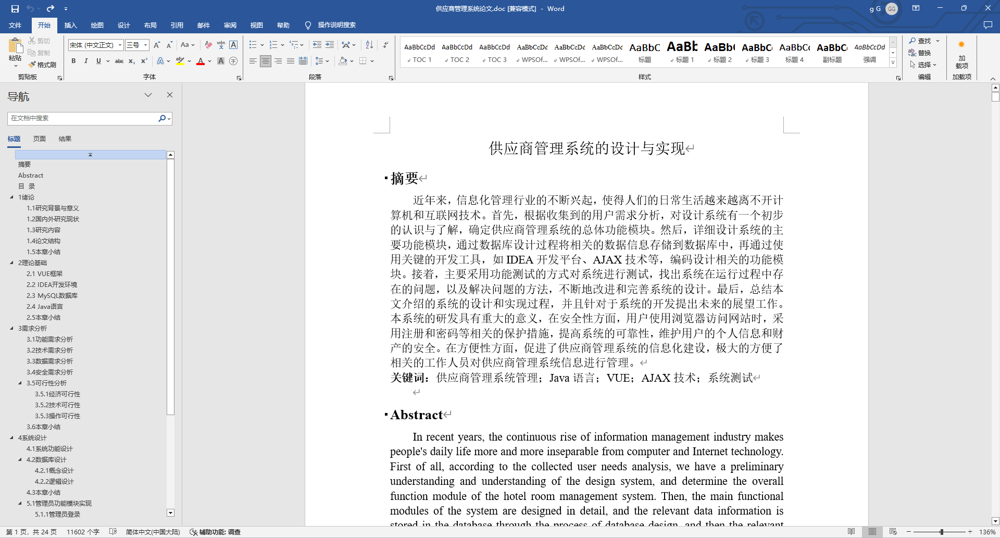
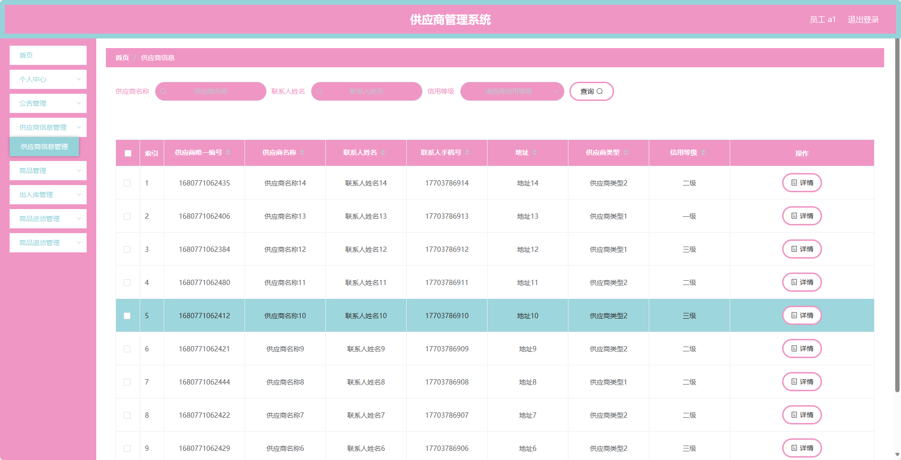
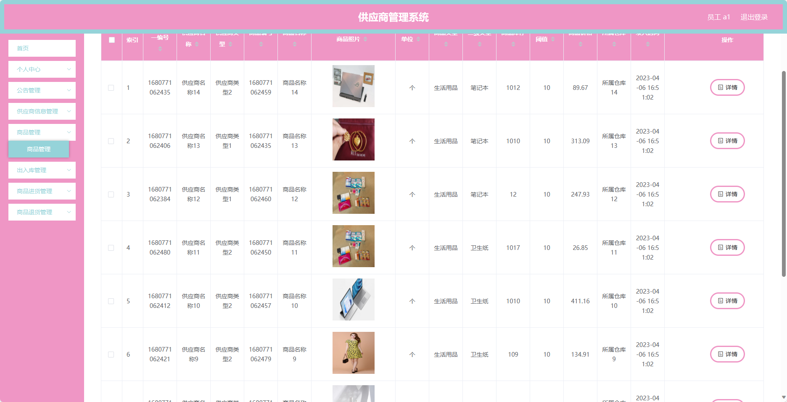
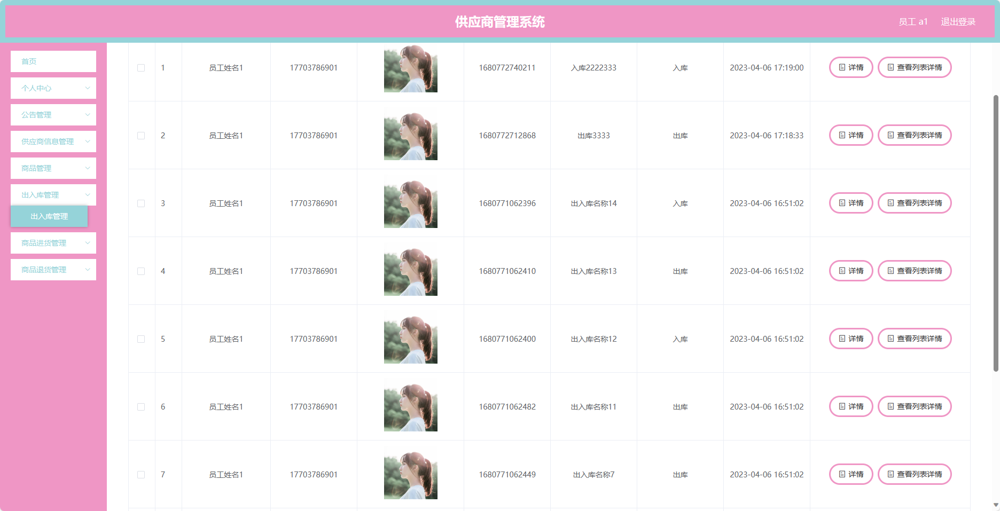
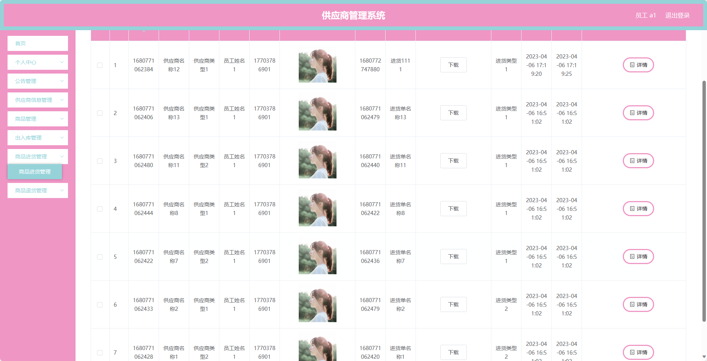
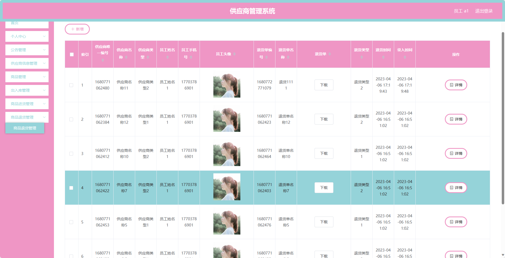
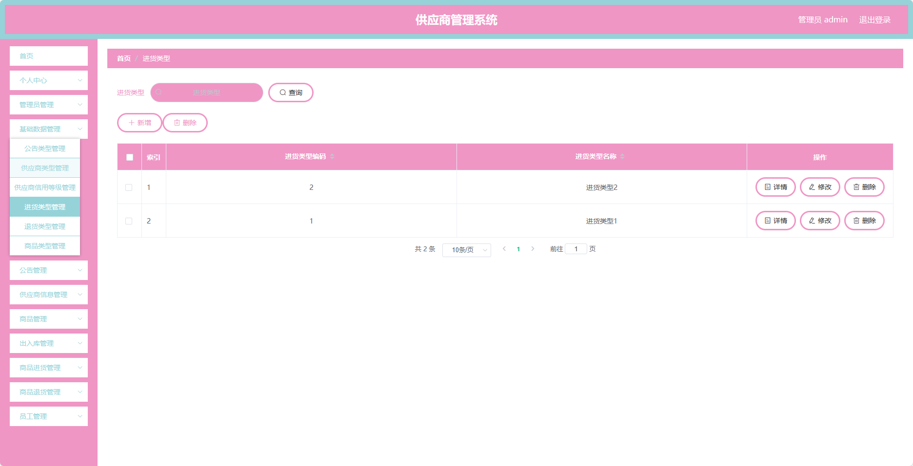
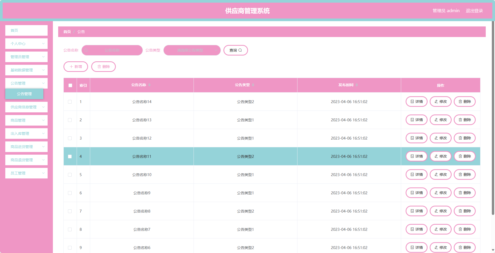
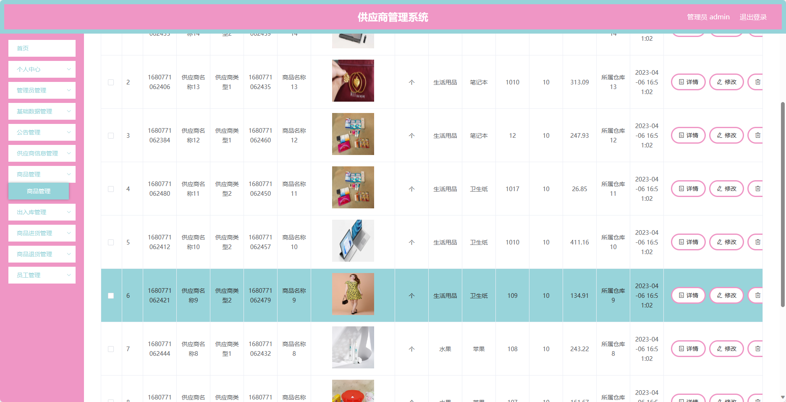

## 基于SpringBoot的供应商管理系统(程序+报告)

###  获取sql数据库文件: 从戎源码网 (https://armycodes.com/) QQ: 386869957 QQ群: 377586148
###  所有系统地址: (https://github.com/YuLin-Coder/AllProjectCatalog) 
###  所有项目以及源代码本人均调试运行无问题 可支持远程安装部署调试、定制修改、代码讲解

## 项目介绍
基于SpringBoot的供应商管理系统，系统包含两种角色：管理员、用户,主要功能如下。

### 【管理员】:
- 个人中心：管理员可以管理个人信息，包括修改密码等操作。
- 管理员管理：管理员可以管理系统中的管理员账号，包括添加管理员、编辑管理员、删除管理员等操作。
- 基础数据管理：管理员可以管理系统的基础数据。
- 公告管理：管理员可以发布和管理公司的公告信息。
- 供应商信息管理：管理员可以查看和管理供应商信息，包括添加供应商、编辑供应商、删除供应商等操作。
- 商品管理：管理员可以管理商品信息，包括添加商品、编辑商品、删除商品等操作。
- 出入库管理：管理员可以查看和管理商品的出入库信息，包括入库记录、出库记录等。
- 商品进货管理：管理员可以管理商品的进货信息，包括记录供应商的进货信息、更新库存等操作。
- 商品退货管理：管理员可以管理商品的退货信息，包括记录退货原因、更新库存等操作。
- 员工管理：管理员可以管理系统的员工账号，包括添加员工、编辑员工、删除员工等操作。

### 【前台】:
- 个人中心：员工可以管理个人信息，包括修改密码等操作。
- 公告管理：员工可以查看公司发布的公告信息。
- 供应商信息管理：员工可以查看和管理供应商信息，包括添加供应商、编辑供应商、删除供应商等操作。
- 商品管理：员工可以管理商品信息，包括添加商品、编辑商品、删除商品等操作。
- 出入库管理：员工可以记录商品的出入库信息，包括入库记录、出库记录等。
- 商品进货管理：员工可以管理商品的进货信息，包括记录供应商的进货信息、更新库存等操作。
- 商品退货管理：员工可以管理商品的退货信息，包括记录退货原因、更新库存等操作。

## 项目技术
- 编程语言：Java
- 数据库：MySQL
- 项目管理工具：Maven
- 前端技术：HTML、CSS、JavaScript、Jquery、Vue
- 后端技术：Spring、SpringMVC、MyBatis

## 运行环境
- JDK版本：JDK1.8及以上
- 开发工具：IDEA、Ecplise、Myecplise都可以
- 数据库: MySQL5.7及以上
- Maven：maven3.0及以上
- Node：14.14.0及以上

## 运行截图

